# Claude Code 源码深度架构分析

> 本文档是对 Anthropic Claude Code CLI 工具源码的全面架构分析。从项目总览到底层实现，自顶向下、逐层深入，帮助读者快速建立对整个系统的完整认知。

---

## 目录

- [第一章 项目总览](#第一章-项目总览)
- [第二章 系统架构](#第二章-系统架构)
- [第三章 入口与启动系统](#第三章-入口与启动系统)
- [第四章 CLI 命令系统](#第四章-cli-命令系统)
- [第五章 AI 对话引擎](#第五章-ai-对话引擎)
- [第六章 工具系统](#第六章-工具系统)
- [第七章 权限与安全系统](#第七章-权限与安全系统)
- [第八章 终端 UI 系统](#第八章-终端-ui-系统)
- [第九章 配置与设置系统](#第九章-配置与设置系统)
- [第十章 扩展系统](#第十章-扩展系统)
- [第十一章 高级特性](#第十一章-高级特性)
- [第十二章 未上线隐藏功能全景](#第十二章-未上线隐藏功能全景)
- [第十三章 设计亮点与可复用模式](#第十三章-设计亮点与可复用模式)

---

## 第一章 项目总览

### 1.1 项目定位

Claude Code 是 Anthropic 出品的 **AI 编程 CLI 工具**，让开发者在终端中与 Claude 进行编程协作。它不是简单的聊天客户端，而是一个集成了文件操作、Shell 执行、代码搜索、MCP 协议、多 Agent 协作等能力的**终端 AI 编程代理（Agentic Coding Agent）**。

核心能力：
- **交互式 REPL**：在终端中进行多轮对话
- **非交互式输出**：`-p/--print` 用于脚本集成
- **工具调用**：AI 可以读写文件、执行命令、搜索代码、浏览网页
- **多 Agent**：子 Agent 并行处理复杂任务
- **MCP 协议**：连接外部工具生态
- **权限系统**：细粒度的安全控制 + 沙箱隔离

### 1.2 技术栈

| 层次 | 技术 | 用途 |
|------|------|------|
| 语言 | TypeScript + TSX | 全栈类型安全 |
| 运行时/打包 | Bun | 高性能 JS 运行时 + 编译期特性开关 |
| CLI 框架 | Commander.js (`@commander-js/extra-typings`) | 命令行解析 |
| 终端 UI | React + 定制 Ink (内嵌 fork) | 组件化终端界面 |
| 布局引擎 | Yoga (react-reconciler) | Flexbox 终端布局 |
| AI SDK | `@anthropic-ai/sdk` + Bedrock/Vertex/Foundry SDK | 多后端 AI 通信 |
| MCP | `@modelcontextprotocol/sdk` | 外部工具协议 |
| 校验 | Zod v4 | 运行时类型校验 |
| 配置监视 | chokidar | 文件变更检测 |
| 样式 | chalk | 终端着色 |

### 1.3 仓库统计

```
总文件数:     ~1900+
顶级目录:     35+
核心模块目录（按文件数排序）:
  utils/       564 文件   -- 横切共享能力（配置、权限、Shell、遥测等）
  components/  389 文件   -- React/Ink 终端 UI 组件
  commands/    207 文件   -- 斜杠命令与子命令
  tools/       184 文件   -- AI 可调用工具实现
  services/    130 文件   -- 核心业务服务（API、MCP、压缩等）
  hooks/       104 文件   -- React hooks
  ink/          96 文件   -- 定制 Ink 终端渲染引擎
```

### 1.4 架构总览

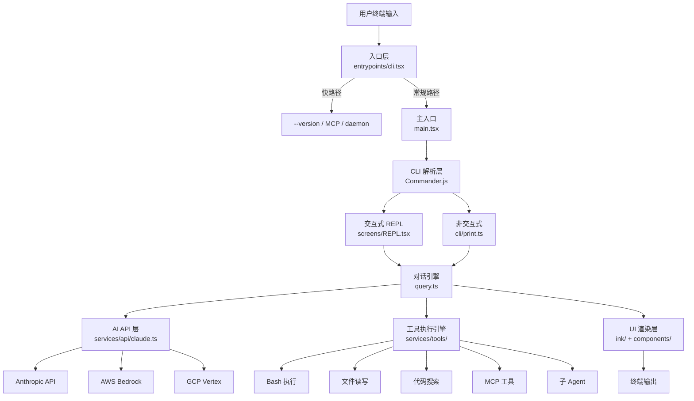

---

## 第二章 系统架构

### 2.1 分层架构

Claude Code 采用**按域分模块 + 全局 Bootstrap 状态 + 命令/工具注册表**的架构模式，而非传统的 DI 容器或事件总线。

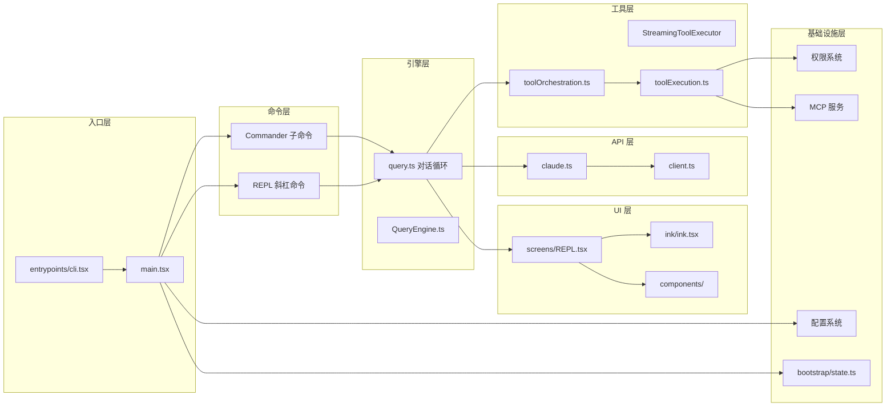

### 2.2 核心数据流

一次完整的用户交互经过以下数据流：

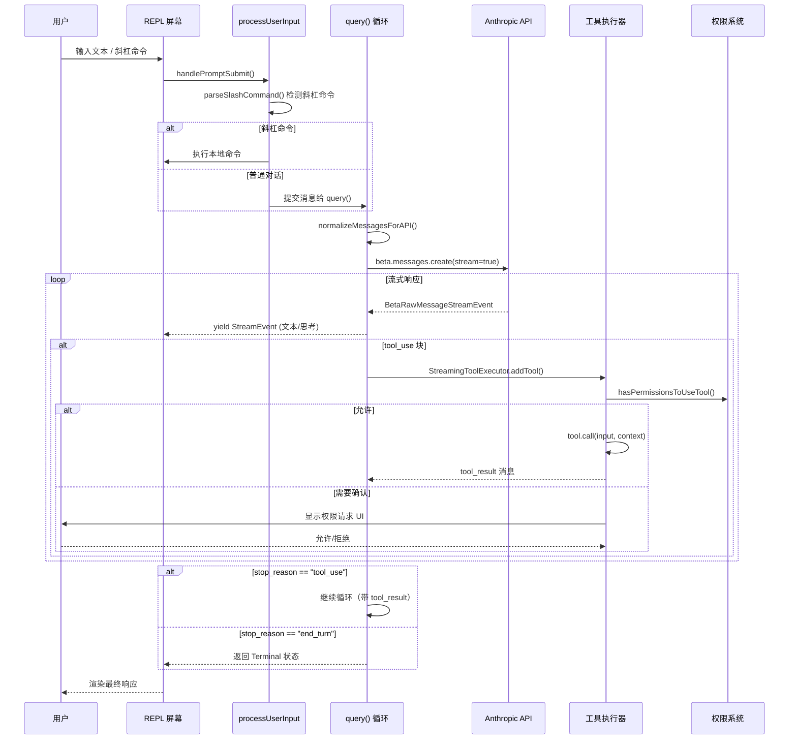

### 2.3 启动流程

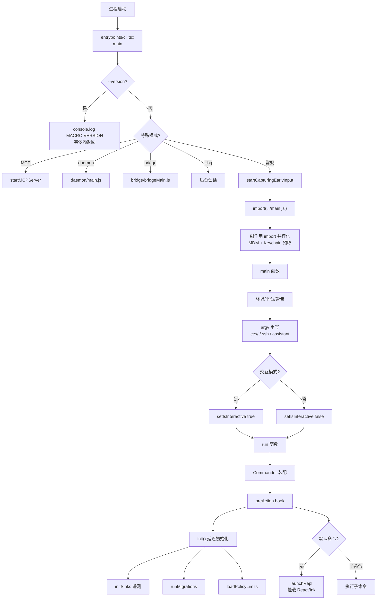

---

## 第三章 入口与启动系统

### 3.1 快路径设计（entrypoints/cli.tsx）

Claude Code 的启动设计体现了**极致的冷启动优化**思想。入口文件 `entrypoints/cli.tsx` 通过**手写的 argv 检测 + 动态 import** 实现快路径分发，避免加载完整 CLI 栈。

核心设计原则：**能不加载的模块就不加载，能延迟的初始化就延迟。**

```typescript
// entrypoints/cli.tsx - 快路径示例
async function main(): Promise<void> {
  const args = process.argv.slice(2);

  // 快路径：--version 零模块加载
  if (args.length === 1 && (args[0] === '--version' || args[0] === '-v')) {
    console.log(`${MACRO.VERSION} (Claude Code)`);  // MACRO.VERSION 编译期内联
    return;
  }

  // 各种特殊模式的动态 import 隔离
  if (feature('DAEMON') && args[0] === '--daemon-worker') { /* ... */ }
  if (args[0] === 'daemon') { /* dynamic import daemon/main.js */ }
  if (args[0] === 'mcp') { /* dynamic import mcp.js */ }

  // 常规路径：加载完整 CLI
  startCapturingEarlyInput();
  const { main: cliMain } = await import('../main.js');
  await cliMain();
}
```

快路径覆盖的场景：

| 快路径 | 条件 | 加载量 |
|--------|------|--------|
| `--version` | 单参数 `-v/-V/--version` | **零依赖** |
| `--dump-system-prompt` | ant-only 内部调试 | 仅 config + prompts |
| `--claude-in-chrome-mcp` | Chrome 集成 MCP | 仅 MCP 模块 |
| `daemon` | 守护进程 | 仅 daemon 模块 |
| `mcp` | MCP 服务模式 | 仅 MCP SDK |
| `--bg` | 后台会话 | 部分 CLI |
| 常规 | 其他所有 | 完整 CLI 栈 |

### 3.2 主入口的并行预热（main.tsx）

`main.tsx` 的前 20 行展示了一个精妙的**副作用 import 并行化**模式：

```typescript
// main.tsx - 副作用 import 必须在所有其他 import 之前
// 1. profileCheckpoint 标记入口时间
import { profileCheckpoint } from './utils/startupProfiler.js';
profileCheckpoint('main_tsx_entry');

// 2. 启动 MDM 子进程（plutil/reg query），与后续 ~135ms 的 import 并行
import { startMdmRawRead } from './utils/settings/mdm/rawRead.js';
startMdmRawRead();

// 3. macOS Keychain 读取并行化（OAuth + legacy API key，节省 ~65ms）
import { ensureKeychainPrefetchCompleted, startKeychainPrefetch } from './utils/secureStorage/keychainPrefetch.js';
startKeychainPrefetch();

// 后续才是常规 import...
import { Command as CommanderCommand } from '@commander-js/extra-typings';
import React from 'react';
// ... 约 135ms 的模块加载时间
```

**设计亮点**：利用 ES Module 的 top-level side effect 特性，在模块求值阶段就启动 I/O 子进程，与后续模块的加载/求值**时间重叠**，显著缩短冷启动。

### 3.3 全局 Bootstrap 状态（bootstrap/state.ts）

Claude Code 没有使用 DI 容器，而是采用集中式可变状态模块 `bootstrap/state.ts` 作为全局共享层：

```typescript
// bootstrap/state.ts
// DO NOT ADD MORE STATE HERE - BE JUDICIOUS WITH GLOBAL STATE

type State = {
  originalCwd: string
  projectRoot: string          // 稳定项目根，启动后不再变
  totalCostUSD: number         // 累计费用
  totalAPIDuration: number     // API 总耗时
  totalInputTokens: number     // 输入 token 总数
  totalOutputTokens: number    // 输出 token 总数
  modelUsage: { [modelName: string]: ModelUsage }
  mainLoopModelOverride: ModelSetting | undefined
  isInteractive: boolean       // 交互/非交互
  kairosActive: boolean        // KAIROS 模式
  cwd: string                  // 当前工作目录
  clientType: string           // 客户端类型
  // ... 更多状态
}
```

通过 getter/setter 函数（如 `getTotalInputTokens()`、`setIsInteractive()`）控制访问，文件头部的注释 "DO NOT ADD MORE STATE HERE" 体现了对全局状态的克制。

---

## 第四章 CLI 命令系统

### 4.1 双层命令体系

Claude Code 有两套独立的命令系统：

```mermaid
graph TB
    subgraph osLevel [OS 级子命令 - Commander.js]
        direction LR
        Main[claude] --> Auth[auth login/logout/status]
        Main --> MCP_Cmd[mcp add/remove/list/serve]
        Main --> Plugin[plugin install/uninstall]
        Main --> Doctor[doctor]
        Main --> Update[update/upgrade]
        Main --> Server_Cmd[server]
    end

    subgraph replLevel [REPL 内斜杠命令]
        direction LR
        Slash["/"] --> Help[/help]
        Slash --> Compact[/compact]
        Slash --> Clear[/clear]
        Slash --> Config_Cmd[/config]
        Slash --> Memory[/memory]
        Slash --> Cost[/cost]
        Slash --> Review[/review]
        Slash --> Vim_Cmd[/vim]
        Slash --> Theme_Cmd[/theme]
        Slash --> Skills_Cmd[/skills]
    end

    User[用户] -->|"claude mcp add ..."| osLevel
    User -->|"在 REPL 中输入 /help"| replLevel
```

### 4.2 Commander 子命令装配（main.tsx）

OS 级命令在 `main.tsx` 的 `run()` 函数中集中装配：

```typescript
// main.tsx ~902 行
const program = new CommanderCommand()
  .configureHelp(createSortedHelpConfig())
  .enablePositionalOptions();

// 延迟初始化 hook - 只在真正执行命令时才 init
program.hook('preAction', async thisCommand => {
  await init();                      // 迁移、遥测、策略等
  const { initSinks } = await import('./utils/sinks.js');
  initSinks();
});

program
  .name('claude')
  .description('Claude Code - starts an interactive session by default')
  .argument('[prompt]', 'Your prompt', String)
  .option('-p, --print', 'Print response without interactive mode')
  .option('--model <model>', 'Model to use')
  .option('--max-turns <turns>', 'Max conversation turns')
  // ... 更多选项
```

### 4.3 REPL 斜杠命令注册表（commands.ts）

斜杠命令采用**聚合注册 + 动态发现**的模式：

```typescript
// commands.ts
const COMMANDS = memoize((): Command[] => [
  addDir, compact, clear, color, commit, config, context, cost, diff,
  doctor, help, ide, keybindings, login, logout, mcp, memory, resume,
  review, session, share, skills, status, tasks, theme, vim, usage,
  // ... 更多内置命令
]);

// 动态加载：合并内置 + 插件 + 技能 + 工作流
const loadAllCommands = memoize(async (cwd: string): Promise<Command[]> => {
  const [
    { skillDirCommands, pluginSkills, bundledSkills, builtinPluginSkills },
    pluginCommands,
    workflowCommands,
  ] = await Promise.all([
    getSkills(cwd),
    getPluginCommands(),
    getWorkflowCommands ? getWorkflowCommands(cwd) : Promise.resolve([]),
  ]);

  return [
    ...bundledSkills,        // 内置技能
    ...builtinPluginSkills,  // 内置插件技能
    ...skillDirCommands,     // 目录发现的技能
    ...workflowCommands,     // 工作流
    ...pluginCommands,       // 插件命令
    ...pluginSkills,         // 插件技能
    ...COMMANDS(),           // 内置命令（最低优先级）
  ];
});
```

### 4.4 编译期特性门控

大量命令通过 `feature()` + 条件 `require()` 实现编译期裁切：

```typescript
// commands.ts - Dead code elimination 模式
import { feature } from 'bun:bundle';

const proactive =
  feature('PROACTIVE') || feature('KAIROS')
    ? require('./commands/proactive.js').default
    : null;

const voiceCommand = feature('VOICE_MODE')
  ? require('./commands/voice/index.js').default
  : null;

const bridge = feature('BRIDGE_MODE')
  ? require('./commands/bridge/index.js').default
  : null;
```

**原理**：`feature()` 在编译期被替换为布尔常量，Bun 的打包器随后进行 dead code elimination，未启用的功能模块不会出现在最终产物中。

---

## 第五章 AI 对话引擎

这是 Claude Code 最核心的模块，负责管理与 AI 模型的多轮对话、工具调用、上下文管理。

### 5.1 对话主循环（query.ts）

对话引擎采用 **AsyncGenerator** 模式，`query()` 函数是一个异步生成器，通过 `yield` 向调用方流式输出事件：

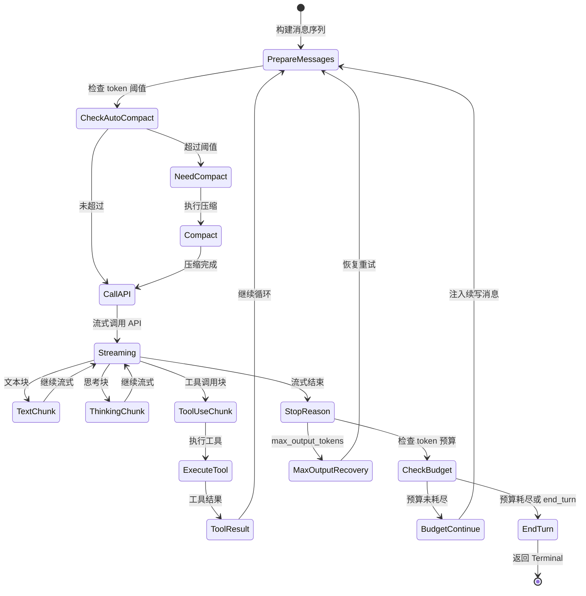

核心代码结构：

```typescript
// query.ts
export async function* query(params: QueryParams):
  AsyncGenerator<StreamEvent | Message | ToolUseSummaryMessage, Terminal> {

  // 不可变参数
  const { systemPrompt, userContext, systemContext, canUseTool } = params;

  // 可变循环状态
  let state: State = {
    messages: params.messages,
    toolUseContext: params.toolUseContext,
    autoCompactTracking: undefined,
    maxOutputTokensRecoveryCount: 0,
    turnCount: 1,
    // ...
  };

  // 主循环
  while (true) {
    const { messages, toolUseContext } = state;

    // 1. 自动压缩检查
    if (shouldAutoCompact(messages, model)) {
      const compacted = await compactConversation(messages, ...);
      state.messages = compacted;
    }

    // 2. 调用 API
    const response = await* streamAPICall(messages, systemPrompt, tools, ...);

    // 3. 流式处理响应
    for await (const event of response) {
      yield event;  // 流式输出给 UI

      if (event.type === 'tool_use') {
        // 4. 工具执行
        const result = await executeTool(event, toolUseContext, canUseTool);
        state.messages.push(result);
      }
    }

    // 5. 决定是否继续
    if (stopReason === 'end_turn') return terminal;
    if (stopReason === 'tool_use') continue;  // 继续循环
    if (stopReason === 'max_tokens') { /* 恢复重试 */ }
  }
}
```

### 5.2 API 通信（services/api/claude.ts）

#### 多后端支持

```typescript
// services/api/client.ts - getAnthropicClient()
function getAnthropicClient() {
  if (process.env.CLAUDE_CODE_USE_BEDROCK) {
    return new AnthropicBedrock({ /* AWS 凭证 */ });
  }
  if (process.env.CLAUDE_CODE_USE_FOUNDRY) {
    return new AnthropicFoundry({ /* Azure AD token */ });
  }
  if (process.env.CLAUDE_CODE_USE_VERTEX) {
    return new AnthropicVertex({ /* GCP 凭证 */ });
  }
  // 默认直连 Anthropic API
  return new Anthropic({ apiKey, baseURL, ... });
}
```

#### 流式处理

Claude Code 使用 **raw stream** 而非 SDK 封装的 `BetaMessageStream`，避免部分 JSON 的 O(n^2) 解析：

```typescript
// services/api/claude.ts ~1818 行
// 使用 raw stream 避免 BetaMessageStream 的 O(n²) JSON 解析
const { data: stream, response } = await anthropic.beta.messages
  .create({ ...params, stream: true })
  .withResponse();

// 空闲看门狗：长时间无 chunk 则 abort
const idleWatchdog = createIdleWatchdog(timeoutMs);

for await (const part of stream) {
  idleWatchdog.reset();
  // 处理 BetaRawMessageStreamEvent
  switch (part.type) {
    case 'content_block_start': /* ... */
    case 'content_block_delta': /* ... */
    case 'message_delta': /* ... */
  }
}
```

#### 流式降级

当流式处理失败时，自动 fallback 到非流式：

```typescript
// 流式失败 → 非流式降级
try {
  yield* streamResponse(params);
} catch (e) {
  logEvent('tengu_streaming_fallback_to_non_streaming');
  const response = await anthropic.beta.messages.create({ ...params, stream: false });
  // 处理非流式响应
}
```

### 5.3 系统提示构建（utils/systemPrompt.ts）

系统提示遵循**优先级链**，高优先级完全替换低优先级：

```typescript
// utils/systemPrompt.ts
export function buildEffectiveSystemPrompt({
  mainThreadAgentDefinition,
  customSystemPrompt,
  defaultSystemPrompt,
  appendSystemPrompt,
  overrideSystemPrompt,
}): SystemPrompt {
  // 优先级 0: Override（如 loop 模式）- 完全替换
  if (overrideSystemPrompt) return asSystemPrompt([overrideSystemPrompt]);

  // 优先级 1: Coordinator 模式
  if (feature('COORDINATOR_MODE') && isCoordinatorMode()) {
    return asSystemPrompt([getCoordinatorSystemPrompt(), ...append]);
  }

  // 优先级 2: Agent 系统提示
  if (mainThreadAgentDefinition) {
    const agentPrompt = getAgentSystemPrompt(mainThreadAgentDefinition);
    if (isProactiveMode()) {
      return asSystemPrompt([...defaultSystemPrompt, agentPrompt, ...append]);
    }
    return asSystemPrompt([agentPrompt, ...append]);
  }

  // 优先级 3: 自定义系统提示
  if (customSystemPrompt) return asSystemPrompt([customSystemPrompt, ...append]);

  // 优先级 4: 默认系统提示
  return asSystemPrompt([...defaultSystemPrompt, ...append]);
}
```

### 5.4 消息规范化

发送给 API 前的消息经过严格的规范化处理：

```typescript
// utils/messages.ts - normalizeMessagesForAPI()
// 功能包括：
// - 过滤 isVirtual 消息（仅 UI 展示用）
// - 剥离过大的 PDF/图片块
// - 确保 tool_use / tool_result 配对
// - 移除本地系统消息（SystemLocalCommandMessage）
// - 与工具列表一致的过滤
```

---

## 第六章 工具系统

### 6.1 工具契约（Tool.ts）

每个工具是一个 `Tool<Input, Output, Progress>` 泛型对象，核心接口：

```typescript
// Tool.ts
export type Tool<Input, Output, P> = {
  name: string
  aliases?: string[]
  searchHint?: string                    // ToolSearch 关键词匹配
  inputSchema: Input                     // Zod schema
  call(args, context, canUseTool, parentMessage, onProgress): Promise<ToolResult<Output>>
  description(input, options): Promise<string>

  // 行为开关
  isEnabled?(context): boolean           // 是否启用
  isReadOnly?(): boolean                 // 是否只读
  isConcurrencySafe?(input): boolean     // 是否可并发
  isDestructive?(): boolean              // 是否破坏性
  shouldDefer?(): boolean                // 是否延迟加载（ToolSearch）
  interruptBehavior?: 'ignore' | 'cancel' | 'warn'

  // 权限
  checkPermissions(input, context): Promise<PermissionResult>
  validateInput?(input): ValidationResult

  // UI 渲染
  renderToolUseMessage(input, options): React.ReactNode
  renderToolResultMessage(output, options): React.ReactNode
  mapToolResultToToolResultBlockParam(result): ToolResultBlockParam
}
```

工具通过 `buildTool(def)` 工厂函数创建，自动填充默认值：

```typescript
// 简化示意
const FileReadTool = buildTool({
  name: 'Read',
  inputSchema: z.object({
    file_path: z.string(),
    offset: z.number().optional(),
    limit: z.number().optional(),
  }),
  isReadOnly: () => true,
  isConcurrencySafe: () => true,   // 读操作可并发
  async call(input, context) {
    const content = await readFile(input.file_path);
    return { data: content };
  },
});
```

### 6.2 工具注册与组装（tools.ts）

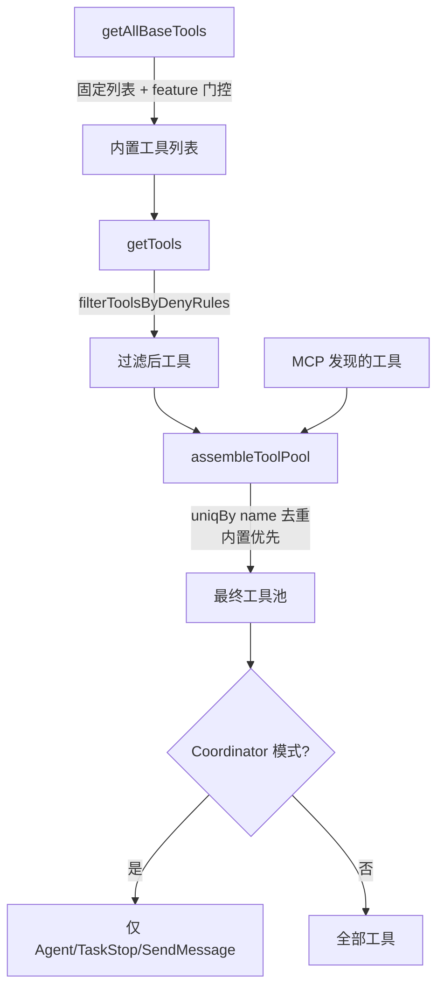

内置工具列表中大量使用条件注册：

```typescript
// tools.ts
export function getAllBaseTools(): Tools {
  return [
    BashTool,
    FileReadTool,
    FileWriteTool,
    FileEditTool,
    GlobTool,
    GrepTool,
    WebFetchTool,
    WebSearchTool,
    AgentTool,
    TaskOutputTool,
    TodoWriteTool,
    NotebookEditTool,
    AskUserQuestionTool,
    // 条件注册
    ...(REPLTool ? [REPLTool] : []),                           // ant-only
    ...(SleepTool ? [SleepTool] : []),                         // PROACTIVE/KAIROS
    ...(MonitorTool ? [MonitorTool] : []),                     // MONITOR_TOOL
    ...(OverflowTestTool ? [OverflowTestTool] : []),           // OVERFLOW_TEST_TOOL
    ...(WebBrowserTool ? [WebBrowserTool] : []),               // WEB_BROWSER_TOOL
    ...cronTools,                                               // AGENT_TRIGGERS
    // ... 更多条件工具
  ].filter(Boolean);
}
```

### 6.3 工具执行引擎

#### 并发编排（toolOrchestration.ts）

工具执行的核心是**并发安全分区**——将连续的工具调用分成"可并发批"和"串行批"：

```typescript
// services/tools/toolOrchestration.ts
export async function* runTools(toolUseMessages, assistantMessages, canUseTool, context) {
  let currentContext = context;

  for (const { isConcurrencySafe, blocks } of partitionToolCalls(toolUseMessages, context)) {
    if (isConcurrencySafe) {
      // 并发安全工具：并行执行（上限 CLAUDE_CODE_MAX_TOOL_USE_CONCURRENCY，默认 10）
      for await (const update of runToolsConcurrently(blocks, ...)) {
        yield update;
      }
    } else {
      // 非并发安全工具：串行执行
      for await (const update of runToolsSerially(blocks, ...)) {
        if (update.newContext) currentContext = update.newContext;
        yield update;
      }
    }
  }
}
```

#### 流式工具执行器（StreamingToolExecutor）

当 API 流式返回 `tool_use` 块时，`StreamingToolExecutor` 实现**边流式边执行**：

```typescript
// services/tools/StreamingToolExecutor.ts
export class StreamingToolExecutor {
  private tools: TrackedTool[] = [];
  private hasErrored = false;
  private siblingAbortController: AbortController;  // Bash 出错时 abort 兄弟

  // 工具到达即入队，条件满足即启动执行
  addTool(block: ToolUseBlock, assistantMessage: AssistantMessage): void {
    const tracked = { id: block.id, block, status: 'queued', ... };
    this.tools.push(tracked);
    this.maybeStartNextTool();
  }

  // 结果按到达顺序缓冲、按原始顺序输出
  async *getRemainingResults(): AsyncGenerator<MessageUpdate> {
    for (const tool of this.tools) {
      if (tool.status !== 'yielded') {
        await tool.promise;  // 等待执行完成
        yield* this.yieldToolResults(tool);
      }
    }
  }

  // 流式降级时丢弃所有半执行结果
  discard(): void {
    this.discarded = true;
  }
}
```

### 6.4 工具执行流程

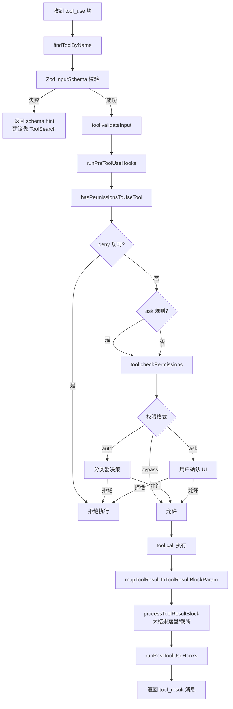

### 6.5 内置工具清单

| 工具名 | 文件 | 功能 | 并发安全 |
|--------|------|------|----------|
| `Bash` | tools/BashTool/ | Shell 命令执行 | 否 |
| `Read` | tools/FileReadTool/ | 文件读取（含 PDF/图片） | 是 |
| `Write` | tools/FileWriteTool/ | 文件创建/覆盖 | 否 |
| `Edit` | tools/FileEditTool/ | 文件精确编辑 | 否 |
| `MultiEdit` | tools/FileEditTool/ | 多处编辑 | 否 |
| `Glob` | tools/GlobTool/ | 文件名模式匹配 | 是 |
| `Grep` | tools/GrepTool/ | 正则搜索 | 是 |
| `WebFetch` | tools/WebFetchTool/ | 网页抓取 | 是 |
| `WebSearch` | tools/WebSearchTool/ | 网络搜索 | 是 |
| `Agent` | tools/AgentTool/ | 子 Agent 并行 | 否 |
| `Task` | tools/TaskCreateTool/ | 后台任务管理 | 否 |
| `TodoWrite` | tools/TodoWriteTool/ | TODO 列表管理 | 是 |
| `NotebookEdit` | tools/NotebookEditTool/ | Jupyter 编辑 | 否 |
| `ToolSearch` | tools/ToolSearchTool/ | 延迟工具发现 | 是 |
| `MCPTool` | tools/MCPTool/ | MCP 外部工具 | 视情况 |
| `AskUser` | tools/AskUserQuestionTool/ | 向用户提问 | 否 |

---

## 第七章 权限与安全系统

### 7.1 权限决策链

Claude Code 实现了一个多层级的权限决策链，确保 AI 操作的安全性：

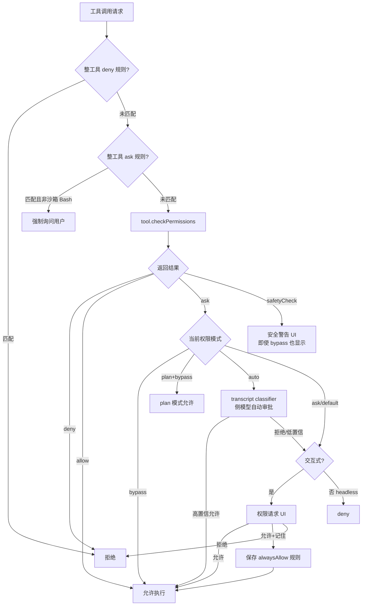

### 7.2 权限规则来源

权限规则来自多个来源，按优先级合并：

```
管理策略（MDM/企业）   最高优先级
        ↓
用户全局设置            ~/.claude/settings.json
        ↓
项目设置               .claude/settings.json
        ↓
本地设置（gitignored）  .claude/settings.local.json
        ↓
运行时动态规则          alwaysAllow 记住的选择
```

### 7.3 沙箱运行时

Bash 工具可以在沙箱中执行，通过 `@anthropic-ai/sandbox-runtime` 实现：

```typescript
// utils/sandbox/sandbox-adapter.ts
// 将 Claude Code 的 settings 转换为 SandboxRuntimeConfig
function buildSandboxConfig(settings) {
  return {
    networkDomains: settings.allowedNetworkDomains,
    filesystemRules: settings.allowedFilePaths,
    webFetchDomains: settings.allowedWebFetchDomains,
    // ...
  };
}
```

```typescript
// tools/BashTool/shouldUseSandbox.ts
// 注意：excludedCommands 不是安全边界，真正的控制是权限/沙箱策略
export function shouldUseSandbox(): boolean {
  return SandboxManager.isSandboxingEnabled();
}
```

### 7.4 推测性分类器竞速

在 auto 模式下，权限 UI 展示前会与分类器结果**竞速**：

```typescript
// hooks/useCanUseTool.tsx - 简化示意
async function canUseTool(tool, input) {
  // 1. 启动推测性分类（与权限 UI 展示并行）
  const classifierPromise = startSpeculativeClassifierCheck(tool, input);

  // 2. 常规权限检查
  const permResult = await hasPermissionsToUseTool(tool, input, context);

  if (permResult.behavior === 'ask') {
    // 3. 竞速：分类器先返回且高置信 → 直接放行
    const classifierResult = await peekSpeculativeClassifierCheck();
    if (classifierResult?.confident && classifierResult.allow) {
      return 'accept';
    }
    // 4. 否则展示权限 UI 等用户确认
    return await showPermissionUI(tool, input);
  }
}
```

---

## 第八章 终端 UI 系统

### 8.1 定制 Ink 引擎

Claude Code 内嵌了一个**深度定制的 Ink fork**，而非使用 npm 上的 Ink 包：

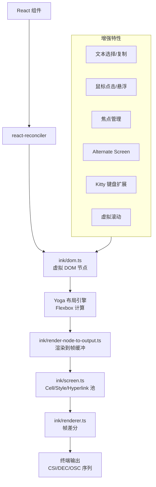

`ink/ink.tsx` 中的 `Ink` 类核心结构：

```typescript
// ink/ink.tsx
class Ink {
  private rootNode: FiberRoot;
  private renderer: Renderer;
  private focusManager: FocusManager;
  private selectionState: SelectionState;
  private logUpdate: LogUpdate;

  constructor(terminal: Terminal) {
    autoBind(this);
    this.rootNode = reconciler.createContainer(/* ConcurrentRoot */);
    // 启用 Kitty 键盘扩展、鼠标跟踪、alternate screen 等
  }

  // 帧渲染：Yoga 布局 → 帧缓冲 → 差分输出
  render() {
    const yogaTree = calculateLayout(this.rootNode);
    const frame = renderNodeToOutput(yogaTree);
    const patches = this.renderer.diff(this.lastFrame, frame);
    writeDiffToTerminal(this.terminal, patches);
    this.lastFrame = frame;
  }
}
```

### 8.2 主题系统

多套主题 + 自动暗/亮模式检测：

```typescript
// utils/theme.ts
type Theme = {
  claude: string          // Claude 品牌色
  permission: string      // 权限提示色
  diff_add: string        // diff 新增色
  diff_remove: string     // diff 删除色
  bash_frame: string      // Shell 框架色
  rainbow: string[]       // 彩虹色序列
  // ... 更多语义色键
}

// 主题列表：dark / light / *-daltonized / *-ansi
const THEMES: Record<ThemeName, Theme> = { ... };

// 自动检测终端背景色（OSC 11 查询）
// utils/systemTheme.ts
function detectSystemTheme(): 'dark' | 'light' {
  // 发送 OSC 11 查询终端背景色
  // 解析 RGB 响应判断暗/亮
}
```

### 8.3 组件架构

```
components/
├── design-system/          # 设计系统基础
│   ├── ThemedBox.tsx       # 主题感知 Box
│   ├── ThemedText.tsx      # 主题感知 Text
│   ├── ThemeProvider.tsx   # 主题 Provider
│   ├── Dialog.tsx          # 模态对话框
│   ├── Tabs.tsx            # 标签页
│   └── FuzzyPicker.tsx     # 模糊搜索选择器
├── Messages.tsx            # 消息列表（虚拟滚动）
├── Message.tsx             # 单条消息路由
├── Markdown.tsx            # Markdown 渲染（marked 引擎）
├── VirtualMessageList.tsx  # 虚拟滚动实现
├── PromptInput/            # 输入框组件
├── permissions/            # 权限 UI 组件
├── Spinner.tsx             # 加载动画
└── ...
```

消息渲染管线：

```
Messages.tsx
  → 归一化/折叠/分组
  → VirtualMessageList（虚拟滚动 + useVirtualScroll）
    → Message.tsx（按类型路由）
      → AssistantTextMessage
        → Markdown.tsx（marked + token 缓存）
      → AssistantThinkingMessage
      → AssistantToolUseMessage
        → 各工具的 UI.tsx
      → UserMessage
```

### 8.4 非交互模式

`--print` 模式走完全不同的输出路径：

```
交互模式:  REPL.tsx → Ink React 组件树 → 终端
非交互模式: cli/print.ts → stdout 直写 / NDJSON / SSE
```

---

## 第九章 配置与设置系统

### 9.1 分层配置合并

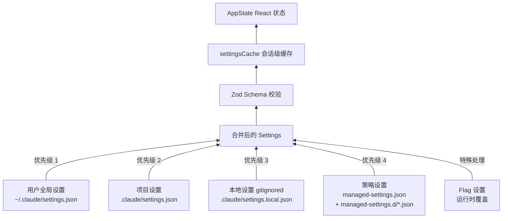

```typescript
// utils/settings/settings.ts
export function getInitialSettings(): Settings {
  const { settings } = getSettingsWithErrors();
  return settings;
}

// 加载顺序：userSettings → projectSettings → localSettings → policySettings
function loadSettingsFromDisk(): RawSettings[] {
  return [
    loadUserSettings(),      // ~/.claude/settings.json
    loadProjectSettings(),   // .claude/settings.json
    loadLocalSettings(),     // .claude/settings.local.json
    loadPolicySettings(),    // managed-settings.json + .d/*.json
  ];
}
```

### 9.2 实时变更检测

```typescript
// utils/settings/changeDetector.ts
// chokidar 监视文件变更 + MDM 轮询
class SettingsChangeDetector {
  start() {
    // 监视所有配置文件来源
    this.watcher = chokidar.watch([
      userSettingsPath,
      projectSettingsPath,
      localSettingsPath,
      managedSettingsPath,
    ]);
    this.watcher.on('change', () => this.handleChange());
  }

  handleChange() {
    // 重新加载 → 合并 → 校验 → 更新 AppState
    const newSettings = loadSettingsFromDisk();
    applySettingsChange(newSettings);
  }
}
```

---

## 第十章 扩展系统

### 10.1 MCP 集成

Claude Code 完整实现了 MCP（Model Context Protocol）客户端：

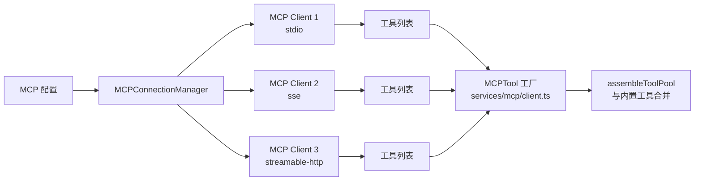

MCP 工具通过 `MCPTool` 模板生成，每个 MCP 服务端发现的工具都被包装为标准的 `Tool` 对象：

```typescript
// services/mcp/client.ts - 简化示意
function createMCPToolInstance(serverTool, connection) {
  return {
    ...MCPTool,                  // 继承基础模板
    name: `mcp__${server}__${serverTool.name}`,
    isMcp: true,
    inputJSONSchema: serverTool.inputSchema,
    async call(input, context) {
      return connection.callTool(serverTool.name, input);
    },
  };
}
```

### 10.2 插件系统

```
claude plugin install <name>     # 安装
claude plugin uninstall <name>   # 卸载
claude plugin list               # 列表
claude plugin enable <name>      # 启用
claude plugin disable <name>     # 禁用
claude plugin marketplace list   # 市场浏览
```

插件可以提供：命令、技能、MCP 服务、hooks。

### 10.3 技能系统

技能（Skills）是斜杠命令的高级形态，支持 SKILL.md 文件描述能力：

```typescript
// commands.ts 中技能来源
const loadAllCommands = memoize(async (cwd) => {
  const [{ skillDirCommands, pluginSkills, bundledSkills }] = await Promise.all([
    getSkills(cwd),  // 从 .claude/skills/ 目录发现
  ]);
  // 技能以最高优先级合并到命令列表
  return [...bundledSkills, ...skillDirCommands, ...COMMANDS()];
});
```

### 10.4 Agent 子系统

AgentTool 允许模型**自己启动子 Agent**，形成多层嵌套：

```
Main Agent (REPL)
  ├── SubAgent 1 (AgentTool: "搜索相关代码")
  │     ├── SubAgent 1.1 (AgentTool: "分析模块A")
  │     └── SubAgent 1.2 (AgentTool: "分析模块B")
  └── SubAgent 2 (AgentTool: "执行修改")
```

子 Agent 的工具集受限（`ALL_AGENT_DISALLOWED_TOOLS`），防止无限递归和危险操作。

---

## 第十一章 高级特性

### 11.1 上下文压缩体系

Claude Code 实现了多层上下文压缩策略：

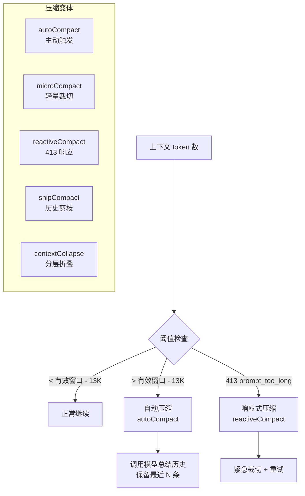

自动压缩的阈值计算：

```typescript
// services/compact/autoCompact.ts
export function getAutoCompactThreshold(model: string): number {
  const effectiveWindow = getEffectiveContextWindowSize(model);
  return effectiveWindow - AUTOCOMPACT_BUFFER_TOKENS; // 13K buffer
}

// 有效窗口 = 模型上下文窗口 - 摘要预留输出 token
export function getEffectiveContextWindowSize(model: string): number {
  const reservedForSummary = Math.min(
    getMaxOutputTokensForModel(model),
    20_000  // p99.99 摘要输出 17,387 tokens
  );
  return getContextWindowForModel(model) - reservedForSummary;
}
```

### 11.2 记忆系统

```
~/.claude/
├── CLAUDE.md                    # 全局记忆
├── auto-memories/               # 自动记忆目录
│   ├── project-xxx/
│   │   ├── coding-style.md
│   │   └── project-context.md
│   └── team/                    # 团队记忆（TEAMMEM）
│       └── shared-conventions.md
└── settings.json

项目/.claude/
├── CLAUDE.md                    # 项目记忆
├── CLAUDE.local.md              # 本地记忆（gitignored）
└── settings.json
```

记忆文件通过 `findRelevantMemories()` 做相关性匹配，注入到系统提示的 attachments 中。

### 11.3 编译期特性开关机制

`feature()` 是 Bun 提供的编译期宏，在打包时被替换为布尔常量：

```typescript
import { feature } from 'bun:bundle';

// 编译期替换：feature('KAIROS') → true/false
if (feature('KAIROS')) {
  // 编译为 true 时：正常包含
  const assistant = require('./assistant/index.js');
  assistant.activate();
}
// 编译为 false 时：整段代码被 DCE 移除
```

这使得同一份源码可以产出**多个构建变体**（内部版 vs 外部版），外部版自动移除所有未启用功能的代码。

---

## 第十二章 未上线隐藏功能全景

通过对仓库中所有 `feature('...')` 调用的系统性梳理，发现 **40+ 个编译期特性门控的隐藏功能**。这些功能在外部发布版中通过 Bun 的 Dead Code Elimination 被完全移除。

### 12.1 功能分类总览

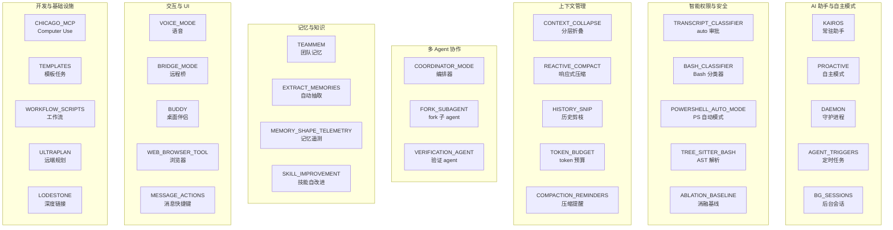

---

### 12.2 AI 助手与自主模式

#### KAIROS — 常驻 AI 助手

> 特性标志：`KAIROS`、`KAIROS_BRIEF`、`KAIROS_CHANNELS`、`KAIROS_PUSH_NOTIFICATION`、`KAIROS_GITHUB_WEBHOOKS`

KAIROS 是 Claude Code 内部开发的**常驻助手模式**。与普通交互式会话不同，KAIROS 模式下 Claude 是一个**持久运行的代理**。

核心特点：
- **Tick 驱动**：按固定间隔（~15 秒阻塞预算）唤醒，检查状态变化
- **追加式日志**：每日独立日志文件（`memdir/paths.ts` 的 `getAutoMemDailyLogPath`）
- **Brief 输出**：`BriefTool` 输出简短状态摘要（类似 CLI 仪表盘）
- **通道通知**：通过 `KAIROS_CHANNELS` 支持多种通知通道
- **推送通知**：`PushNotificationTool` 发送 OS 通知
- **GitHub Webhook**：`SubscribePRTool` 监听 PR 事件

关键文件：`assistant/index.js`、`assistant/gate.js`、`tools/SleepTool/`、`tools/BriefTool/`、`tools/PushNotificationTool/`、`tools/SendUserFileTool/`

```typescript
// main.tsx
const assistantModule = feature('KAIROS')
  ? require('./assistant/index.js') : null;
const kairosGate = feature('KAIROS')
  ? require('./assistant/gate.js') : null;

// KAIROS 与 PROACTIVE 共享大量路径
if (feature('KAIROS') && assistantModule?.isAssistantMode()) {
  // 激活常驻助手
}
```

#### PROACTIVE — 自主执行模式

> 特性标志：`PROACTIVE`

PROACTIVE 使模型**主动推进任务**而非被动等待用户输入：

- 追加系统提示指导模型主动行动
- 周期性 **tick**（`subscribeToProactiveChanges`、`getNextTickAt`）
- 搭配 `SleepTool` 实现"等待后继续"
- 用户中断时 `pauseProactive` / `resumeProactive`
- Compaction 时有专用"非首次唤醒"提示

#### DAEMON — 长驻守护进程

> 特性标志：`DAEMON`

实现 `claude daemon` 命令——一个长驻的监督进程：

- `--daemon-worker` 内部子进程（轻量级，不加载完整 CLI）
- 与 assistant/Agent SDK 集成
- 管理 cron 任务、bridge WebSocket
- 零 configs/analytics 的 lean worker 模式

#### AGENT_TRIGGERS — 定时任务与远程触发器

> 特性标志：`AGENT_TRIGGERS`、`AGENT_TRIGGERS_REMOTE`

本地定时任务工具族：

```typescript
// tools.ts
const cronTools = feature('AGENT_TRIGGERS') ? [
  require('./tools/ScheduleCronTool/CronCreateTool.js').CronCreateTool,
  require('./tools/ScheduleCronTool/CronDeleteTool.js').CronDeleteTool,
  require('./tools/ScheduleCronTool/CronListTool.js').CronListTool,
] : [];
```

远程触发器调用 claude.ai Code API 的 `/v1/code/triggers`，需 OAuth + 策略允许。

#### BG_SESSIONS — 后台会话

> 特性标志：`BG_SESSIONS`

- `~/.claude/sessions/<pid>.json` 注册后台会话
- `claude ps` 枚举运行中的会话
- tmux 下 `claude --bg` 退出时 detach 而非杀进程
- 会话状态写入 `status/waitingFor`

---

### 12.3 智能权限与安全

#### TRANSCRIPT_CLASSIFIER — Auto 审批模式

> 特性标志：`TRANSCRIPT_CLASSIFIER`

这是 Claude Code 权限系统的**核心隐藏功能**——`auto` 权限模式，通过**侧模型（yoloClassifier）**自动审批工具调用：

```typescript
// utils/permissions/yoloClassifier.ts
// 用规则模板 + 对话上下文构建 prompt
// 调用小模型判断：允许/拒绝

// types/permissions.ts
// 加入 'auto' 权限模式
...(feature('TRANSCRIPT_CLASSIFIER') ? (['auto'] as const) : [])
```

特点：
- 内外两套 permissions 模板
- GrowthBook `tengu_auto_mode_config` 远程配置
- circuit breaker：连续拒绝过多时自动关闭 auto 模式
- Beta header `afk-mode` 标识 auto 会话

#### BASH_CLASSIFIER — Bash 命令安全分类

> 特性标志：`BASH_CLASSIFIER`

专门针对 Bash 命令的安全分类器，与 `TRANSCRIPT_CLASSIFIER` 并行工作：

- **推测性分类**：权限 UI 展示前启动分类，高置信时直接放行
- 竞速机制：分类器结果与权限 UI 展示**竞速**
- 独立于全局 transcript classifier 运行

#### TREE_SITTER_BASH — AST 级命令解析

> 特性标志：`TREE_SITTER_BASH`、`TREE_SITTER_BASH_SHADOW`

用 **tree-sitter-bash** WASM/NAPI 解析 Bash 命令为 AST，替代正则表达式做安全分析：

```typescript
// utils/bash/parser.ts
export function parseCommand(command: string) {
  if (feature('TREE_SITTER_BASH') || feature('TREE_SITTER_BASH_SHADOW')) {
    const result = parseCommandRaw(command);
    if (result === PARSE_ABORTED) {
      // 超时/节点预算耗尽 → fail-closed
      return null;
    }
    return result;
  }
  // 回退到正则
  return parseCommandRegex(command);
}
```

`TREE_SITTER_BASH_SHADOW` 允许在不启用正式路径时做 shadow 对比遥测。

#### ABLATION_BASELINE — 评测用消融基线

> 特性标志：`ABLATION_BASELINE`

```typescript
// entrypoints/cli.tsx
if (feature('ABLATION_BASELINE') && process.env.CLAUDE_CODE_ABLATION_BASELINE) {
  // 批量禁用高级功能，用于 A/B 测试基线对比
  for (const k of [
    'CLAUDE_CODE_SIMPLE',
    'CLAUDE_CODE_DISABLE_THINKING',
    'DISABLE_INTERLEAVED_THINKING',
    'DISABLE_COMPACT',
    'DISABLE_AUTO_COMPACT',
    'CLAUDE_CODE_DISABLE_AUTO_MEMORY',
    'CLAUDE_CODE_DISABLE_BACKGROUND_TASKS',
  ]) {
    process.env[k] ??= '1';
  }
}
```

---

### 12.4 上下文管理

#### CONTEXT_COLLAPSE — 分层上下文折叠

> 特性标志：`CONTEXT_COLLAPSE`

在 autoCompact 之前的更精细策略：

- 按 90%/95% 阈值**阶梯触发**
- 折叠状态持久化在独立 store
- 提供 `CtxInspectTool` 检查上下文状态
- 开启时**抑制主动 autoCompact**，避免抢跑
- 413 时先 drain staged collapse，再交给 reactive compact

#### REACTIVE_COMPACT — 响应式压缩

> 特性标志：`REACTIVE_COMPACT`

在 API 返回 `prompt_too_long`（413）后自动触发的**紧急压缩**：

- 与 `CONTEXT_COLLAPSE` 串联（先 drain collapse 再 RC）
- GrowthBook `tengu_cobalt_raccoon` 为 true 时进入**仅 reactive** 路径
- `hasAttemptedReactiveCompact` 防止死循环

#### HISTORY_SNIP — 历史剪枝

> 特性标志：`HISTORY_SNIP`

给用户消息打 `[id:]` 标签，供模型通过 `SnipTool` 精确定位并裁切历史片段，释放 token。

#### TOKEN_BUDGET — Token 预算控制

> 特性标志：`TOKEN_BUDGET`

用户可在输入中指定 token 预算：

```
"帮我重构这个模块 +500k"     → 500K token 预算
"全面优化性能 +1m"           → 1M token 预算
```

主循环在 90% 预算时注入续写提示，连续 3 次 diminishing returns（增量 <500 token）时自动停止。

```typescript
// query/tokenBudget.ts
export function checkTokenBudget(tracker, usage): 'continue' | 'stop' {
  const remaining = tracker.total - tracker.used;
  if (remaining <= 0) return 'stop';
  if (tracker.continuationCount >= 3 && isdiminishingReturns(tracker)) return 'stop';
  return 'continue';
}
```

---

### 12.5 多 Agent 协作

#### COORDINATOR_MODE — 编排器模式

> 特性标志：`COORDINATOR_MODE`

主会话变身**纯编排器**，工具集收紧：

```typescript
// constants/tools.ts
export const COORDINATOR_MODE_ALLOWED_TOOLS = [
  'Agent', 'TaskStop', 'SendMessage', 'TodoWrite', 'ToolSearch',
  // ... 仅允许协调类工具
];
```

- 环境变量 `CLAUDE_CODE_COORDINATOR_MODE` 启用
- Worker agent 用 `subagent_type: worker`
- 任务完成以 `<task-notification>` 回调

#### FORK_SUBAGENT — Fork 子 Agent

> 特性标志：`FORK_SUBAGENT`

省略 `subagent_type` 时隐式 fork：

- 子 agent 继承父级**完整对话历史 + 系统提示**
- 共享前缀实现 **prompt cache** 复用
- 强制异步 + `<task-notification>` 通知模型
- 防递归 fork（coordinator 模式下关闭）

#### VERIFICATION_AGENT — 验证 Agent

> 特性标志：`VERIFICATION_AGENT`

内置只读验证子 agent：

```typescript
// tools/AgentTool/built-in/verificationAgent.ts
// 系统提示强调对抗式验证、必须跑命令
// 输出结构化判定：VERDICT: PASS | FAIL | PARTIAL
```

TodoWrite/TaskUpdate 在大量实作后会催促 spawn verifier。

---

### 12.6 记忆与知识

#### TEAMMEM — 团队共享记忆

> 特性标志：`TEAMMEM`

团队共享记忆目录（auto-memory 的 `team` 子树）：

- `memdir/teamMemPaths.ts` 管理路径
- 文件监视同步（`teamMemorySync/watcher`）
- 读搜工具对 TeamMem 文件的特殊计数
- GrowthBook `tengu_herring_clock` 控制
- KAIROS 日日志模式打开时优先于 TEAMMEM

#### EXTRACT_MEMORIES — 自动记忆抽取

> 特性标志：`EXTRACT_MEMORIES`

每轮 query 结束后 fork 子 agent，从 transcript 自动抽取 durable memory。

#### SKILL_IMPROVEMENT — 技能自改进

> 特性标志：`SKILL_IMPROVEMENT`

每 5 条用户消息后用小模型分析对话，检测用户对技能的偏好/纠正，自动改进 `SKILL.md`。

---

### 12.7 交互与 UI

#### VOICE_MODE — 语音模式

> 特性标志：`VOICE_MODE`

按住说话 / 语音转写功能：

- WebSocket 连接 Anthropic `voice_stream` STT 服务
- 需要 OAuth（非 API Key）
- `VoiceProvider` 在 AppState 中注入
- GrowthBook 紧急关闭开关 `tengu_amber_quartz_disabled`

#### BRIDGE_MODE — 远程控制桥

> 特性标志：`BRIDGE_MODE`

与 claude.ai 的远程控制桥接：

- JWT/OAuth 认证
- WebSocket 同步控制本地 REPL
- 运行时资格：`isClaudeAISubscriber()` + GrowthBook `tengu_ccr_bridge`

#### BUDDY — 桌面伴侣

> 特性标志：`BUDDY`

终端内的 **Gacha 式桌面宠物**系统：

```typescript
// buddy/companion.ts
// Mulberry32 + 用户 ID 盐做确定性 roll
// 物种、稀有度、数值属性全部由 seed 决定
// ASCII 精灵动画 + 旁白气泡
```

- 按用户 ID 随机"孵化"物种/稀有度
- `CompanionSprite` / `CompanionFloatingBubble` 铺在 REPL 布局上
- 系统提示注入 `companion_intro`：告诉模型"伴侣是旁观的小动物"

#### WEB_BROWSER_TOOL — 内置浏览器

> 特性标志：`WEB_BROWSER_TOOL`

基于 `Bun.WebView` 的内置浏览器工具 + 面板（`WebBrowserPanel`），用于 dev server 调试、页面脚本执行、截图等。

#### MESSAGE_ACTIONS — 消息快捷键

> 特性标志：`MESSAGE_ACTIONS`

全屏 TUI 下的消息级操作：展开/折叠、编辑用户消息、复制全文、复制工具参数等。

---

### 12.8 开发与基础设施

#### CHICAGO_MCP — Computer Use

> 特性标志：`CHICAGO_MCP`（内部代号 Chicago）

内置 Computer Use MCP 服务：

- 截图、键鼠控制、前台应用操作
- Swift/Rust 本地适配器
- 单实例锁文件 `computer-use.lock`
- `cleanupComputerUseAfterTurn` 回合结束恢复 UI

#### ULTRAPLAN — 远端深度规划

> 特性标志：`ULTRAPLAN`

将**深度规划**交给远端 CCR（Cloud Code Runner）：

- 最长约 **30 分钟**规划时间
- 本地轮询等待
- 浏览器端审批
- 批准后用哨兵串 `__ULTRAPLAN_TELEPORT_LOCAL__` 瞬移回本地

```typescript
// commands/ultraplan.tsx
// 模型 ID 来自 GrowthBook tengu_ultraplan_model
// prompt 刻意避免裸写 ultraplan 关键字
```

#### TEMPLATES — 模板任务

> 特性标志：`TEMPLATES`

`claude new` / `list` / `reply` 命令族：

- `CLAUDE_JOB_DIR` 下的作业目录
- 每个 turn 结束时的 job 分类器
- 防 symlink/hijack 安全防护

#### WORKFLOW_SCRIPTS — 工作流脚本

> 特性标志：`WORKFLOW_SCRIPTS`

`WorkflowTool` + `LocalWorkflowTask` 后台任务类型，带权限和详情对话框。

#### LODESTONE — 深度链接协议

> 特性标志：`LODESTONE`

注册 `claude-cli://` 协议，使浏览器/系统可拉起 Claude Code：

```typescript
// utils/backgroundHousekeeping.ts
if (feature('LODESTONE') && getIsInteractive()) {
  ensureDeepLinkProtocolRegistered(); // 失败退避 24h
}
```

#### COMMIT_ATTRIBUTION — 提交归因

> 特性标志：`COMMIT_ATTRIBUTION`

git commit/PR 归因文案 + git trailer 行：

- "Generated with Claude Code (N-shotted by model, … memories)"
- 内部 allowlist 仓库追加结构化 trailer
- 配合 `SHOT_STATS` 做 N-shot 分布统计

#### UDS_INBOX — 跨会话消息

> 特性标志：`UDS_INBOX`

通过 Unix Domain Socket 实现跨 Claude Code 实例的消息传递：

- `SendMessage` 支持 `uds:/path.sock` 和 `bridge:session_...` 地址
- `ListPeersTool` 发现本地和桥接 peer
- 消息以 `<cross-session-message>` 包装

#### 其他基础设施特性

| 特性标志 | 功能 |
|----------|------|
| `CONNECTOR_TEXT` | API 流式协议中的 connector_text 内容块 |
| `MCP_RICH_OUTPUT` | MCP 工具结果富文本展示 |
| `PERFETTO_TRACING` | Perfetto 性能跟踪 |
| `ENHANCED_TELEMETRY_BETA` | 增强遥测 |
| `SLOW_OPERATION_LOGGING` | 慢操作日志 |
| `HARD_FAIL` | 硬失败模式（内部调试） |
| `ALLOW_TEST_VERSIONS` | 允许测试版本号（99.99.x） |
| `FILE_PERSISTENCE` | BYOC 环境文件同步到 Files API |
| `NATIVE_CLIPBOARD_IMAGE` | macOS NSPasteboard 原生剪贴板图片 |
| `HOOK_PROMPTS` | Hooks 子进程交互式提示 |
| `DIRECT_CONNECT` | 直连会话模式 |
| `SSH_REMOTE` | SSH 远程连接 |
| `AUTO_THEME` | 自动主题检测 |
| `AWAY_SUMMARY` | 离开摘要 |
| `OVERFLOW_TEST_TOOL` | 溢出测试工具 |
| `TERMINAL_PANEL` | 终端面板捕获 |
| `CCR_AUTO_CONNECT` | CCR 自动连接 |
| `CCR_REMOTE_SETUP` | CCR 远程设置 |
| `UPLOAD_USER_SETTINGS` | 上传用户设置 |

### 12.9 Feature Flag 门控机制

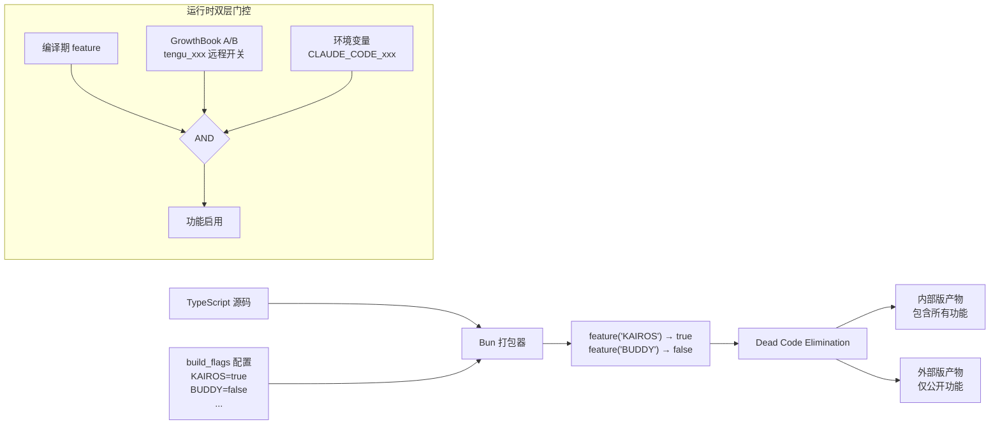

---

## 第十三章 设计亮点与可复用模式

### 13.1 快路径启动优化

**模式**：动态 import 隔离，`--version` 零依赖

**价值**：CLI 工具的冷启动至关重要。通过手写的 argv 检查 + 动态 import，`claude --version` 的响应时间接近零。

**可复用**：任何 CLI 工具都可以采用"快路径前置 + 动态加载主逻辑"的模式。

### 13.2 副作用 Import 并行化

**模式**：在 ES Module 的 top-level 执行副作用（启动子进程/I/O），与后续模块加载时间重叠。

```typescript
import { startMdmRawRead } from './settings/mdm/rawRead.js';
startMdmRawRead(); // 立即启动子进程，不等待结果
// 后续 ~135ms 的 import 期间，子进程在后台运行
```

**价值**：节省 ~65ms 的 macOS keychain 读取时间。

**可复用**：任何需要多个初始化 I/O 的应用都可以利用此模式。

### 13.3 编译期特性门控

**模式**：`feature()` 宏 + 条件 `require()` + Bun DCE

**价值**：同一份代码库产出多个构建变体，未启用功能的代码完全不出现在产物中。

**可复用**：适用于任何需要多版本/多租户构建的项目。关键是用 `require()` 而非 `import`，因为 `require()` 在条件分支中不会被 tree-shaking 提取到模块顶层。

### 13.4 AsyncGenerator 对话循环

**模式**：`async function* query()` 通过 `yield` 流式输出事件，调用方可以中断、恢复、组合。

**价值**：
- 流式响应自然映射到生成器 yield
- 工具调用结果作为新消息注入循环
- `yield*` 可以组合嵌套生成器
- 调用方（REPL/print）可以用 `for await` 消费

**可复用**：任何多轮交互 + 流式输出的场景。

### 13.5 工具并发分区

**模式**：`partitionToolCalls` 将连续工具调用按 `isConcurrencySafe` 标记分成并发批和串行批。

```
[Read, Read, Grep] → 并发批（全部 concurrencySafe）
[Write]            → 串行批
[Read, Read]       → 并发批
[Bash]             → 串行批
```

**价值**：最大化只读操作的并行度，同时保证写操作的顺序一致性。

**可复用**：任何需要混合并行/串行任务调度的系统。

### 13.6 StreamingToolExecutor

**模式**：工具随流式到达即入队执行，结果按原始顺序缓冲输出。

**价值**：不等待全部工具调用到达就开始执行，减少端到端延迟。Bash 出错时通过 `siblingAbortController` 取消兄弟任务。

**可复用**：适用于流式数据 + 并行处理 + 有序输出的场景。

### 13.7 分层配置合并

**模式**：多来源配置按优先级合并（user → project → local → policy），Zod 校验，chokidar 实时变更检测。

**价值**：支持企业管理策略（MDM）、项目级约定、个人偏好的灵活组合。

**可复用**：任何需要多层级配置的应用。

### 13.8 定制 Ink 终端 UI

**模式**：内嵌 fork 的 Ink + react-reconciler + Yoga，实现 React 组件化的终端 UI。

**价值**：
- React 组件模型用于终端渲染
- Yoga Flexbox 布局
- 帧差分最小化终端写入
- 虚拟滚动处理长消息列表
- 完整的主题系统

**可复用**：任何复杂的终端 UI 应用。

### 13.9 权限沙箱双保险

**模式**：代码级权限决策链 + 运行时沙箱（`@anthropic-ai/sandbox-runtime`）双层防护。

**价值**：即使权限逻辑有漏洞，沙箱仍然阻止越权操作。`safetyCheck` 类型即使在 bypass 模式下也强制显示。

**可复用**：任何需要安全执行不可信代码的系统。

### 13.10 全局 Bootstrap 状态

**模式**：`bootstrap/state.ts` 集中管理全局可变状态，替代 DI 容器。

**价值**：简单直接，避免了 DI 框架的复杂性。getter/setter 函数控制访问，文件头部注释约束状态膨胀。

**可复用**：中等复杂度应用的轻量级状态管理方案。

### 13.11 GrowthBook + 编译期开关双层门控

**模式**：编译期 `feature()` 决定代码是否存在，运行时 GrowthBook 决定功能是否激活。

```typescript
// 编译期：代码是否包含
if (feature('TRANSCRIPT_CLASSIFIER')) {
  // 运行时：功能是否激活
  const config = getFeatureValue('tengu_auto_mode_config');
  if (config.enabled) { /* ... */ }
}
```

**价值**：编译期保证外部版不含内部代码，运行时保留灰度发布/紧急关闭能力。

**可复用**：任何需要多版本 + A/B 测试的 SaaS 产品。

### 13.12 推测性分类器竞速

**模式**：权限 UI 展示前同时启动分类器，高置信结果抢在用户交互前完成。

**价值**：在 auto 模式下，大部分工具调用可以在用户无感知的情况下自动放行，只有低置信度的调用才需要人工确认。

**可复用**：任何"默认需要确认但可以自动化"的审批流程。

---

## 附录 A：核心文件索引

| 模块 | 核心文件 |
|------|---------|
| 入口 | `entrypoints/cli.tsx`, `main.tsx` |
| 对话引擎 | `query.ts`, `QueryEngine.ts` |
| API 通信 | `services/api/claude.ts`, `services/api/client.ts` |
| 工具定义 | `Tool.ts`, `tools.ts` |
| 工具执行 | `services/tools/toolOrchestration.ts`, `services/tools/StreamingToolExecutor.ts`, `services/tools/toolExecution.ts` |
| 权限 | `utils/permissions/permissions.ts`, `utils/sandbox/sandbox-adapter.ts` |
| UI 引擎 | `ink/ink.tsx`, `ink.ts` |
| REPL | `screens/REPL.tsx`, `replLauncher.tsx` |
| 组件 | `components/Messages.tsx`, `components/Message.tsx`, `components/Markdown.tsx` |
| 配置 | `utils/settings/settings.ts`, `utils/config.ts` |
| 全局状态 | `bootstrap/state.ts`, `state/AppState.tsx` |
| 命令 | `commands.ts`, `commands/` |
| 系统提示 | `constants/prompts.ts`, `utils/systemPrompt.ts` |
| 主题 | `utils/theme.ts`, `components/design-system/ThemeProvider.tsx` |
| 消息 | `utils/messages.ts`, `types/message.ts` |
| 压缩 | `services/compact/autoCompact.ts`, `services/compact/compact.ts` |
| 记忆 | `memdir/`, `utils/claudemd.ts` |
| MCP | `services/mcp/client.ts`, `services/mcp/config.ts` |
| 插件 | `plugins/`, `services/plugins/pluginCliCommands.ts` |
| 技能 | `skills/`, `tools/SkillTool/SkillTool.ts` |
| Agent | `tools/AgentTool/AgentTool.tsx`, `coordinator/coordinatorMode.ts` |

## 附录 B：依赖关系（从源码推断）

| 包名 | 用途 |
|------|------|
| `@anthropic-ai/sdk` | Anthropic API 客户端 |
| `@anthropic-ai/bedrock-sdk` | AWS Bedrock 后端 |
| `@anthropic-ai/vertex-sdk` | GCP Vertex 后端 |
| `@anthropic-ai/foundry-sdk` | Azure Foundry 后端 |
| `@anthropic-ai/sandbox-runtime` | 沙箱运行时 |
| `@modelcontextprotocol/sdk` | MCP 协议 SDK |
| `@commander-js/extra-typings` | CLI 框架 |
| `react` + `react-reconciler` | UI 框架 |
| `zod/v4` | 运行时类型校验 |
| `chalk` | 终端着色 |
| `chokidar` | 文件变更监视 |
| `lodash-es` | 工具函数 |
| `marked` | Markdown 解析 |
| `auto-bind` | 自动方法绑定 |
| `signal-exit` | 退出信号处理 |

---

> 本文档基于仓库快照分析生成。部分通过 `feature()` 门控的模块在当前快照中仅有引用但无实现源码（如 `proactive/`、`daemon/`、`contextCollapse/` 等），相关功能描述基于引用代码和 README 推断。
